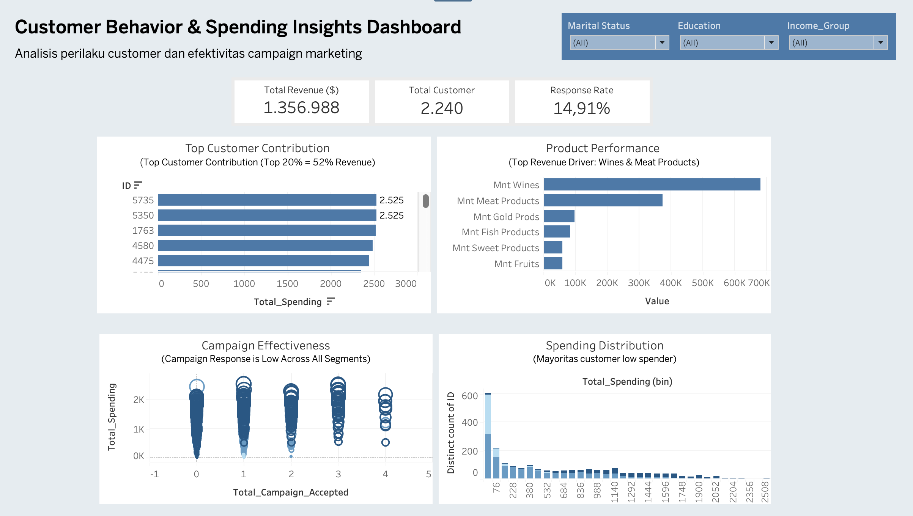

# 🛒 Supermarket Customer Analysis

## 📌 Overview
Project ini bertujuan untuk menganalisis perilaku customer dan efektivitas campaign marketing pada perusahaan retail supermarket.

## 📊 Key Insights
- 💰 Top 20% customer menyumbang ~52% revenue
- 🥩 Wines & Meat Products adalah revenue driver utama
- 📉 Response rate hanya 14.91%
- 👥 Mayoritas customer adalah low spender

## 📈 Dashboard Preview

## 🛠️ Tools
- Python
- Pandas
- Tableau

## 👤 Author
**Miranda**
